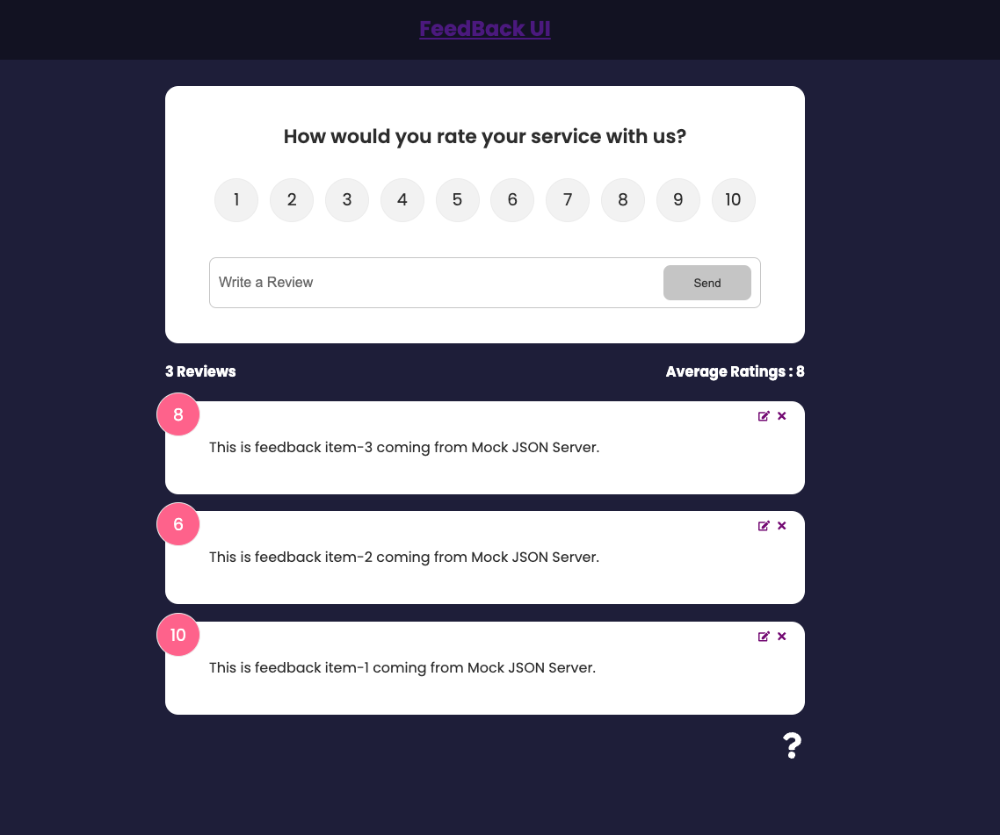

# Feedback App Using React JS

## Overview

This application is designed to collect user feedback through an intuitive interface. Users can rate their experience and provide comments, which are then displayed in a list format.

## Features

- **User Feedback Submission**: Users can rate their experience on a scale of 1 to 10 and leave comments.
- **Feedback Display**: Submitted feedback is displayed in a list, showing the user's rating and comments.

## Tech Stack

- **React.js**: Frontend framework for building the user interface.
- **React Context API**: For state management across components.
- **Vercel**: Deployment platform for hosting the application.
